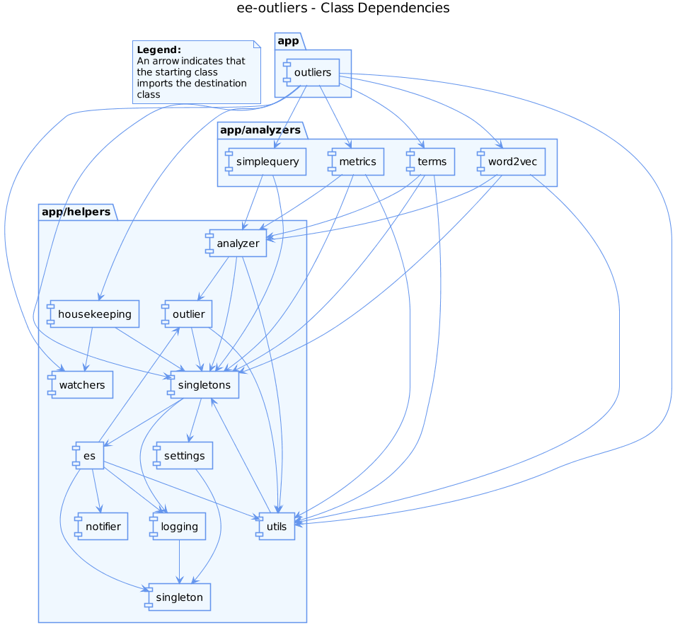
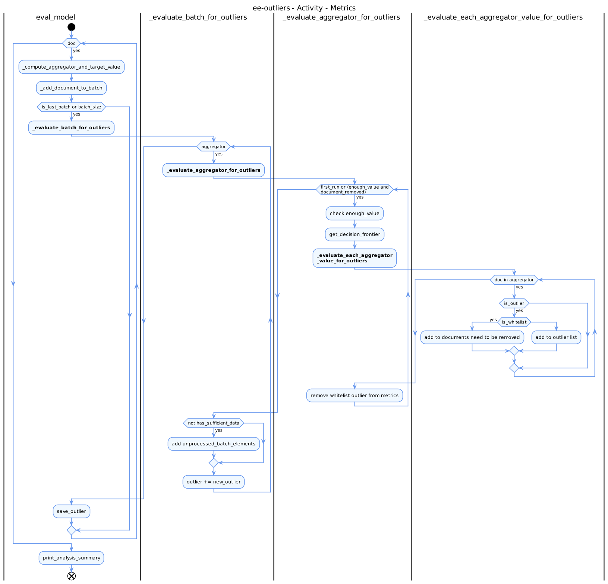

<a href="DEVELOPMENT.md">&#8592; Information for developers</a>

# UML

**Table of contents:**
- [Class dependencies](#class-dependencies)
- [Whitelist process](#whitelist-process)

Some [UML](https://en.wikipedia.org/wiki/Unified_Modeling_Language) file have been created to help understand and begin to work on the project.
These files were written using the [PlantUML](http://plantuml.com/) syntax. This syntax has the advantage of being in text format. This makes it easier to use on git (unlike the binary format).

Each UML Schema is store in two format: picture (in `PNG`) and source code (in `TXT`).

## Class dependencies

To correctly understand the project, it is important to understand the different link between classes.

     
    <i>The class dependencies (only helpers) - (<a href="UML/uml_class_dependencies_only_helpers.txt">Source code</a>)</i>

The previous schema is a simplification. In the following schema, all class are represented:

     
    <i>The class dependencies - (<a href="UML/uml_class_dependencies.txt">Source code</a>)</i>

## Whitelist process

Visit the [whitelist page](WHITELIST.md) to understand what is the role of the whitelist. Concretely, whitelist is used when an outliers is detected. If the outlier is whitelisted, it is removed and the current batch is recompute.

Concretely, for metrics, the process is the following:

     
    <i>Process of Metrics (linked to whitelisted) - (<a href="UML/uml_sequence_metrics.txt">Source code</a>)</i>

Another view is the "activity" diagram, which allow to understand the different looop and the differents steps in Metrics:

     
    <i>Activity diagram for Metrics - (<a href="UML/uml_activity_metrics.txt">Source code</a>)</i>

